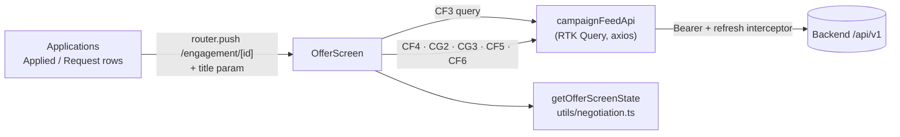

# Implementation — Negotiation (Offer screen)

How the creator side of price negotiation is built in the mobile app. Shipped
as build-plan item **23** (commit `8007b20`, "negotiate from an offer
screen"); deliverables in a counter came with item **24**, and accepting
through an agreement sheet with item **34** (see "Accepting through the
agreement sheet" below). For the API contract see the backend's
`docs/features/campaign/implementations/NEGOTIATION.md`; for the screen spec
see [`../screen/offer/README.md`](../screen/offer/README.md) and the
Applications list in
[`../screen/apply-campaign/campaign-list.md`](../screen/apply-campaign/campaign-list.md).

## What it does

A creator taps a row on either Applications tab (Applied = their own
applications, Request = business invitations) and lands on the **Offer
screen** for that engagement: the offer thread, the rounds left, and the
actions they can take right now.

| Action               | Shown when                                                           | Backend call                                                  |
| -------------------- | -------------------------------------------------------------------- | ------------------------------------------------------------- |
| Accept               | Engagement `pending`/`countered`, pending offer sent by the business | Agreement sheet → `CF4` `POST /me/engagements/:id/accept` `{ offerId }` |
| Counter              | Negotiable, rounds left > 0, pending offer is not the creator's own  | `CG2` `POST /engagements/:id/offers` `{ amountMinor, note? }` |
| Withdraw my offer    | Negotiable, pending offer sent by the creator                        | `CG3` `POST /engagements/:id/offers/:offerId/withdraw`        |
| Decline              | Negotiable, `origin: invited`                                        | `CF5` `POST /me/engagements/:id/decline` `{ reason }`         |
| Withdraw application | Negotiable, `origin: requested`                                      | `CF6` `POST /me/engagements/:id/withdraw` `{ reason }`        |

Once accepted, the screen shows "You'll receive" — the agreed price **plus**
the licensing markup, the creator's whole pay (F-2/F-6) — with "View
agreement" and "Deliver work". No escrow copy is shown (escrow is item 27);
the earlier "the business has until … to fund escrow" line and the claim that
the markup is the business's cost were both removed in item 34.

## Architecture

| Layer       | File                                                                                                          | Responsibility                                                                                                                                     |
| ----------- | ------------------------------------------------------------------------------------------------------------- | -------------------------------------------------------------------------------------------------------------------------------------------------- |
| Route       | `app/(details)/engagement/[id].tsx`                                                                           | `(details)` group, no tab bar; re-exports `OfferScreen`                                                                                            |
| Screen      | `scenes/campaigns/OfferScreen.tsx` + `offerScreen.style.ts`                                                   | Loads `CF3`, renders thread / rounds / summary / forms / confirm dialogs, runs the mutations, maps errors                                          |
| Rules       | `scenes/campaigns/utils/negotiation.ts` (+ test)                                                              | `getOfferScreenState`, `sortOffers`, `parseCounterAmount`, `validateOptionalText`, `formatOfferDate`                                               |
| API         | `scenes/campaigns/api/campaignFeedApi.ts` (+ test)                                                            | `getMyEngagement`, `acceptOffer`, `sendCounterOffer`, `withdrawOffer`, `withdrawMyEngagement`; `declineMyEngagement` gained the per-engagement tag |
| Types       | `scenes/campaigns/types/myEngagement.ts`                                                                      | `MyEngagementDetail` (round counters, markup, close reason, escrow deadline), `EngagementOfferStatus`, `CounterOfferArgs`, `CloseEngagementArgs`   |
| List wiring | `scenes/campaigns/Applications.tsx`, `hooks/useCampaignsFeed.ts`, `components/elements/CampaignRequestCard/*` | Rows open the Offer screen; Request tab includes `countered`; `showActions` hides quick buttons on countered rows                                  |

### Data flow

1. A row calls `router.push({ pathname: '/engagement/[id]', params: { id, title } })`.
   The campaign title rides along because `CF3` returns no campaign summary.
2. `OfferScreen` reads `id`/`title` with `useLocalSearchParams` and loads
   `useGetMyEngagementQuery({ engagementId })`, which provides
   `{ type: 'MyEngagement', id }`.
3. `getOfferScreenState(detail)` decides which actions render.
4. Each action goes through `run(action, call)`: it tracks the in-flight
   action (all buttons disabled), closes the form on success, and maps errors.
5. Every negotiation mutation invalidates the engagement, `MyEngagements`
   (both Applications tabs) and `CampaignFeed` (the feed's "Applied" badge).
   Nothing is invalidated on error.

### Rules mirrored from the backend

`getOfferScreenState` (creator viewer) returns `pendingOffer`,
`pendingIsMine`, `roundsRemaining`, `isNegotiable`, `canAccept`, `canCounter`,
`canWithdrawOffer`, `canDecline`, `canWithdrawApplication`, `isFinalOffer`:

- negotiable only while `status` is `pending` or `countered`;
- one pending offer at a time; accept only the business's;
- rounds left = `max(0, negotiationRoundLimit - negotiationRoundCount)`; a
  round is one offer including the opening one (default cap 3);
- **turn rule** — no counter while the creator's own offer is pending
  ("Waiting for the business to respond."); withdraw it instead;
- Decline for invitations, Withdraw application for the creator's own
  requests;
- `isFinalOffer` when no rounds are left and the business's offer is pending.

The server stays the authority; these only decide what to show.

### Accepting through the agreement sheet (item 34)

Accept never fires `CF4` directly. It opens `AgreementSheet`
(`scenes/campaigns/components/AgreementSheet.tsx`) in `confirm` mode, built by
`buildCreatorAgreement` (`scenes/campaigns/utils/agreement.ts`):

- the business's pending offer + `licensingMarkupMinor(amount, tier)` (tier 2
  +25%, tier 3 +50%, integer division like the backend trigger), with the
  campaign's tier, business and content deadline from `CB2`
  (`useGetFeedCampaignQuery`, fetched only while the sheet is open). If `CB2`
  fails, the sheet offers Retry and no Accept;
- "Accept & confirm" sends `CF4` with the offer id the sheet shows; on success
  the sheet switches to `confirmed` mode, built from the refetched `CF3`
  (`agreedAmountMinor + licensingMarkupMinor`, never recomputed);
- the terms the creator pressed Accept on are kept, so after a `409` refetch
  that no longer has that offer pending, the sheet stays open with the server
  message and Accept disabled;
- `review=1` (from the Request tab) opens the sheet once per screen mount.

The same sheet opens read-only from "View agreement" on the Offer and
Deliverables screens. It never shows a platform fee, VAT, processing fee, the
business's total, or payment copy.

### Applications list changes

- **Request tab** lists invitations in `pending` **and** `countered`
  (`PENDING_INVITATION_STATUSES`), so a negotiation in progress stays
  reachable. Before this, a countered invitation vanished from both tabs.
- Quick Accept/Decline on the Request tab stay for `pending` rows.
  Decline sends `CF5` in place; **Accept** (since item 34) opens the Offer
  screen with `review=1` so the agreement sheet is up — accepting is never one
  tap, and there is a single accept path. (`acceptMyEngagement` stays exported
  but the list no longer uses it.) `countered` rows pass `showActions={false}`
  to `CampaignRequestCard` and are answered on the Offer screen.
- Tapping any row (either tab) opens the Offer screen instead of Campaign
  Details; the Offer screen has a "View campaign" link.

### Error handling

| Response                                                                                                   | UI                                                                                                    |
| ---------------------------------------------------------------------------------------------------------- | ----------------------------------------------------------------------------------------------------- |
| `409` (`NEGOTIATION_LIMIT_REACHED`, turn-rule `CONFLICT`, `OFFER_NOT_PENDING`, `INVALID_STATE_TRANSITION`) | Server `message` in an inline banner (`accessibilityRole="alert"`, polite live region); refetch `CF3` |
| `422`                                                                                                      | Message plus per-field errors (`amountMinor`, `note`, `reason`) on the form fields                    |
| Anything else                                                                                              | "Couldn't update the offer. Please try again."                                                        |
| `CF3` load failure                                                                                         | `CampaignsEmptyState` error variant with "Try again"                                                  |

Client-side validation: counter amount must be a positive BDT number
(thousands separators, up to 2 decimals) → minor units; note and reason are
optional, ≤ 2000 chars. Decline / Withdraw application send `reason: ""` when
left blank, matching the Request tab's quick decline.

## Tests and verification

| Check              | Result at implementation                                                                                                                                                                   |
| ------------------ | ------------------------------------------------------------------------------------------------------------------------------------------------------------------------------------------ |
| `npm run test`     | 147 suites / 736 tests, incl. `negotiation.test.ts` (25), 7 new `campaignFeedApi.test.ts` cases, `OfferScreen.test.tsx` (5), a `CampaignRequestCard` case, updated `Applications.test.tsx` |
| `npm run lint`     | 0 errors (2 pre-existing warnings in untouched files)                                                                                                                                      |
| `npx tsc --noEmit` | No errors in changed files (2 pre-existing errors in auth tests)                                                                                                                           |
| Manual (Expo)      | Not run in the build session; see below                                                                                                                                                    |

### Try it

With the backend and `npm run dev` running:

1. Receive an invitation → Applications → Request → tap the row: round 1
   "Business" with Accept, Counter, Decline.
2. Counter → "Waiting for the business to respond."; back on the Request tab
   the row shows no quick buttons.
3. After the business counters and rounds reach 0 → "This is the final offer —
   accept or decline."
4. Accept → agreement sheet ("Review the agreement", "You'll receive …") →
   Accept & confirm → "Agreement confirmed"; the screen shows the Accepted
   badge and "You'll receive" (licensing included) with View agreement.
5. From the Applied tab, open your own application → Withdraw my offer /
   Withdraw application.

Counters against an existing pending offer need the backend's counter-offer
fix (`a0436de` on backend `feat/campaign-negotiation`); older backends return
`422 BUSINESS_RULE_VIOLATION`.

## Known limitations

- No escrow funding (backend item 19 / mobile item 27); no offers inside
  Messaging (item 22).
- Offer expiry isn't shown (no `expiresAt` on the offer summary).
- No Figma design exists for this screen; it uses existing components and
  tokens (redesigned with a gradient header card, chat-bubble thread and a
  pinned action bar — see `../screen/offer/README.md`) and should be revisited
  when one lands.
